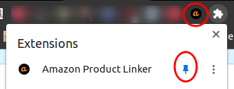
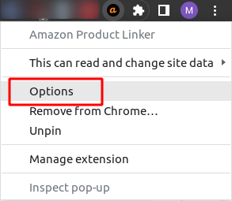
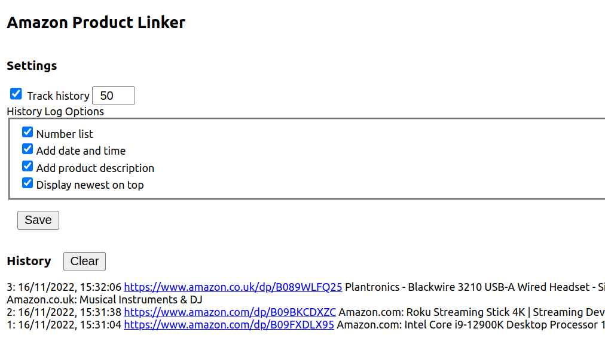

# Amazon Product Linker

'Amazon Product Linker' will create link to a product page of active Amazon tab and send it to the clipboard for easy sharing. The received link does not require user to be loged into Amazon to see the product page unlike when address is copied and shared from the browser's address bar. This adds some anonymity, reduces tracking and targetted advertising by Amazon. The product links are stored in local cache and synchronised between Chrome browsers if user is logged in to Chrome. List of previously created links can be seen on plugin Options page. The list can be fomatted with addtional metadata like date & time or product description and then used to share multiple links as needed. The list can be cleared and history logging disabled if not required. 

## Installation
1. Clone Repo or Download Zip (```git clone https://github.com/MaxOfLondon/chrome-plugin-amazon-product-linker.git```)
2. Visit chrome://extensions/ and turn on "Developer mode"
3. Click "Load unpacked" button and navivigate to the folder you downloaded from GitHub

If you pull down new changes or make a change to the extension's files locally, you will need to hit the "refresh" icon in chrome://extensions/ in order to run the new functionality.

## How to use
<ol>
<li>Pin the Amazon Product Linker icon.
  <p align="center">
    
  </p>
</li>
<li>When on Amazon product page click the Amazon Product icon.</li>
<li>Paste link to IM, email or other sharing media.</li>
<li>To see list of created links right-click on Amazon Product Linker icon and chose Options.
  <p align="center">
    
  </p>
</li>
<li>Adjust options as required then press Save.
  <p align="center" width="100%">
    
  </p>
</li>
<li>Copy list of links and use as required.</li>
</ol>
Happy linking!
